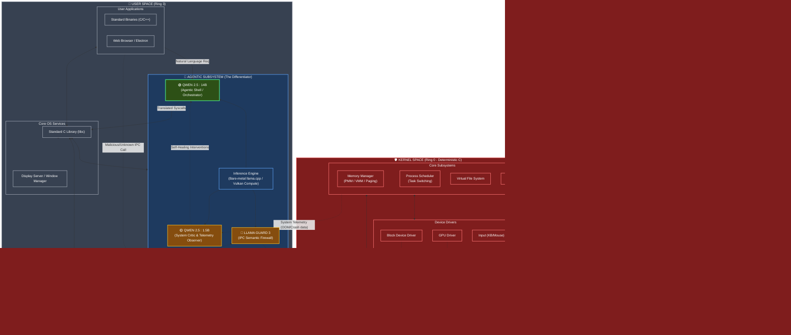

# Bare-Metal Agentic OS — Complete End-to-End Architecture

> **Context:** This is the complete, full-stack architecture for a true "Agentic OS." It maps out everything from the bare-metal hardware and UEFI boot sequence up through the POSIX-style kernel, and finally into the User Space where the Agentic LLM Subsystem operates alongside standard applications.

---

## The Complete End-to-End OS Stack

Unlike a standard OS (like Linux or Windows) where the primary interface is a POSIX shell or a dumb Window Manager, this Agentic OS places an **Inference Engine** and **Agentic Orchestrator** at the very heart of User Space. 

---

## How the Agentic OS Operates (The 3 Pillars)

To be a true "Agentic OS" and not just a Linux distro with a python script running on top, the AI must be integrated deeply into the core user-space services. Here is how the models in the diagram function:

### 1. The Agentic Shell (`qwen2.5:14b`)
Instead of a user opening a bash terminal and typing `rm -rf /var/log/*.log`, the user simply tells the OS: *"Clear out my old logs to save space."*
The **Agentic Shell** (Qwen 14B) acts as the bridge. It parses the natural language, understands the filesystem state, and translates the intent into strict, deterministic POSIX system calls (`unlink()`, `rmdir()`) sent to the kernel via `libc`.

### 2. The Semantic IPC Firewall (`llama-guard3`)
In a standard OS like Windows or Linux, security is binary: if an app has the right permissions (e.g., `chmod 777` or Administrator rights), the kernel executes its commands blindly.
In the Agentic OS, **Llama Guard 3** sits as a middleware filter on the IPC router. If an untrusted application attempts a high-privilege system call (like deleting a system directory or opening a bizarre network port), the kernel halts the execution and asks Llama Guard to evaluate the *intent* of the payload. If the intent is malicious (e.g., ransomware behavior), Llama Guard vetoes the IPC call.

### 3. The Self-Healing Observer (`qwen2.5:1.5b`)
The OS kernel streams raw telemetry (memory usage, page faults, CPU spikes) to the tiny **1.5B System Critic**. Because this model is so small, it can run constantly in the background with negligible overhead. 
If it detects patterns that usually lead to a kernel panic or an Out-Of-Memory (OOM) crash, it alerts the Agentic Shell to proactively kill non-essential processes before the system crashes. 

---

## What Must Be Built First (The Kernel Mandate)

As shown in the architecture, the entire Agentic Subsystem lives in **Ring 3 (User Space)**. 
Therefore, before you can compile `llama.cpp` to run on your bare-metal OS, your `plans_to_implement` must focus on completing the Kernel layer:

1. **Memory Management (VMM & Paging):** You need robust `malloc()` and memory mapping, or the 9GB Qwen model will crash instantly.
2. **Virtual File System (VFS):** You need an ext2/FAT32 driver to load the `.gguf` model weights from the NVMe disk into RAM.
3. **GPU/Vulkan Drivers:** Running 14B parameters on a raw CPU will result in < 1 token per second. You must write or port a basic Vulkan or display driver for your kernel to offload math to the GPU.
