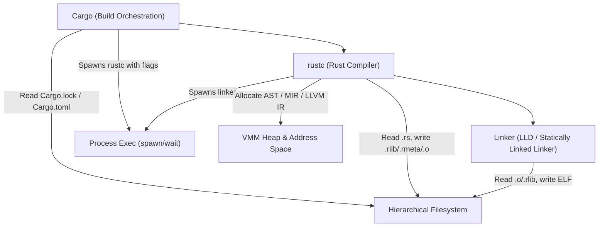

# Self-Hosting Toolchain Requirements Audit

> **Task Reference:** `docs/TASK_SELF_HOSTING_GROUNDWORK.md` — Milestone 1  
> **Target Toolchain Components:** `rustc`, `cargo`, and a minimal linker (`lld` / `mold` / `wasm-ld`)  
> **Target OS:** Agentic OS (`x86_64-unknown-none` -> native userspace)  
> **Date:** 2026-09-15  

---

## 1. Executive Summary

Phase 15's exit criterion is *"Agentic OS builds its own release image while running natively on Agentic OS itself."*

Executing full `cargo build` and `rustc` locally requires a concrete set of OS capabilities. This document audits the actual runtime requirements of `rustc`, `cargo`, and an ELF linker against the current Agentic OS kernel architecture, identifying exact matches, partial support, and specific gaps.

---

## 2. Process Execution Model: `posix_spawn` vs. `fork`/`exec`

### Requirements
- Standard Unix implementations traditionally use `fork()` followed by `execve()`.
- However, modern Rust `std::process::Command` on Linux/POSIX uses `posix_spawnp()` via `CLONE_VM | CLONE_VFORK` to avoid duplicating entire address spaces (which is prohibitively expensive for multi-gigabyte compiler processes).
- On Windows, `CreateProcessW` has always been purely spawn-based (`spawn(path, argv, envp)`).
- `cargo` only needs to:
  1. Invoke `rustc` with command-line arguments and environment variables.
  2. Capture or inherit standard I/O streams (stdout, stderr).
  3. Wait synchronously or asynchronously for exit codes via `waitpid`.
- `rustc` only needs to:
  1. Invoke the linker (`lld`) with object files and flags.
  2. Wait for the linker process to complete and inspect the exit code.

### Agentic OS Architecture Analysis
- **Current State:** The kernel contains an ELF64 loader (`kernel_rs/src/elf.rs`), capability grant system (`kernel_rs/src/installer.rs`), and preemptive scheduler (`kernel_rs/src/thread.rs`). However, processes are only spawned at fixed points (boot-time device managers, demo apps, or fixed desktop grid slots).
- **Audit Finding:** A traditional `fork()` model is **unnecessary** and actively detrimental to memory consumption. A typed, capability-gated `spawn(path, argv) -> pid` syscall with `wait(pid) -> exit_code` completely satisfies both `cargo` and `rustc`.
- **Verdict for Milestone 2:** Implement generic on-demand `SYS_PROCESS_SPAWN`, `SYS_PROCESS_WAIT`, and `SYS_PROCESS_EXIT`.

---

## 3. Command Line (`argv`), Environment (`envp`), and Working Directory (`cwd`)

### Requirements
- **`argv`:** `rustc` invocations from `cargo` routinely exceed 100 arguments (crate type, edition, cfg flags, library search paths `-L`, extern declarations `--extern`, sysroot paths). Total argument string size can reach 16KB to 64KB per command.
- **`envp`:** `cargo` passes environment variables (`CARGO_PKG_NAME`, `CARGO_MANIFEST_DIR`, `OUT_DIR`, `RUSTFLAGS`, `TARGET`).
- **`cwd`:** Relative path resolution (e.g. `src/main.rs`, `target/release/...`) depends on a per-process current working directory.

### Agentic OS Architecture Analysis
- **Current State:** Today's user processes receive a single fixed page `INFO_VADDR` (`0x0000_0000_005X_0000`) containing a hand-typed struct (e.g. `NetClientInfo`, `SampleAppInfo`). There is no generic argument passing vector.
- **Audit Finding:**
  - For minimal toolchain components (e.g. `tcc` or minimal compilers in Milestone 3), passing an array of null-terminated string pointers or a packed argument buffer at a standardized user virtual address (e.g. top of the user stack `user_rsp`) is sufficient.
  - Per-process `cwd` can be stored in the process control block or resolved to an ext2 directory inode.
- **Verdict:** Design `SYS_PROCESS_SPAWN` to accept an `argv` buffer packed into user memory, establishing the ABI foundation.

---

## 4. Concurrency, File Descriptors, and VMM Limits

### Requirements
- **Concurrent File Descriptors:**
  - `rustc` opens crate metadata (`.rmeta`), library archives (`.rlib`), and intermediate source files. A compilation unit for a small project requires 20–50 open files simultaneously.
  - A large crate build may open up to 256–1024 file descriptors.
- **`mmap` and Memory Footprint:**
  - `rustc` uses `mmap` to load source files and object files lazily without reading them into heap buffers.
  - **Memory:** `rustc` is notoriously memory-heavy. Building a small `no_std` crate requires ~100MB–256MB of heap memory; building complex crates can require 1GB–2GB.
  - In contrast, a minimal C compiler (`tcc`) requires < 16MB of RAM and < 10 file descriptors.
- **Linker Requirements:**
  - `lld` maps all `.o` and `.a` input files into its address space simultaneously, creates output sections, and writes the output ELF directly.

### Agentic OS Architecture Analysis
- **Current State:**
  - `kernel_rs/src/vmm.rs` provides 4-level paging (`PML4 -> PDPT -> PD -> PT`) with 4KB pages and dynamic page allocation via `pmm::alloc_page()`.
  - Heap: Kernel heap is 8MB (`HEAP_INIT_START` at `0xffffff0000000000`). User address spaces start at 0 and map text/data/stack independently.
  - File I/O: Handled by IPC request/reply with `virtio_blk_driver` over `file_service`. Currently lacks an open file descriptor table per process.
- **Audit Finding:**
  - Agentic OS running on QEMU with 256MB–512MB RAM can comfortably host `tcc` or a minimal self-hosted compiler.
  - Hosting `rustc` natively will require expanding QEMU memory to 1GB–2GB and implementing anonymous demand-paged memory mapping.
- **Verdict:** Implement file-descriptor-like inode handles in userspace and support multi-file concurrent requests over `file_service`.

---

## 5. Offline and Vendored Networking Requirements

### Requirements
- Does `cargo` require network connectivity during a self-hosted build?
- Standard `cargo build` queries `crates.io` over HTTPS to update index registries and download crates.
- However, `cargo build --offline` combined with `cargo vendor` (pre-downloading all crate sources into a `vendor/` directory and setting `.cargo/config.toml` source replacement) requires **zero network connectivity**, zero DNS queries, and zero socket operations.

### Agentic OS Architecture Analysis
- **Current State:** Agentic OS has a real TCP/IPv4 network stack (`netstack_driver`) and HTTP GET client (`net_client`), but no TLS/HTTPS engine.
- **Audit Finding:**
  - Because `cargo` can operate 100% offline with vendored dependencies, **the absence of TLS/HTTPS in Agentic OS is NOT a blocker for self-hosting groundwork.**
  - An entire codebase and all vendored dependencies can be placed directly onto the ext2 disk image.
- **Verdict:** Keep self-hosting build path strictly local-first and offline-vendored.

---

## 6. Comprehensive Syscall ABI Gap Matrix

| Subsystem / Operation | POSIX Equivalent | Agentic OS Current State | Required for Milestone 2 | Required for Full Self-Host |
| :--- | :--- | :--- | :--- | :--- |
| **Process Spawn** | `posix_spawn` / `fork+exec` | Boot/grid spawn only (`installer.rs`) | **YES** (`SYS_PROCESS_SPAWN`) | Enhanced with `envp` |
| **Process Wait** | `waitpid` | No ring-3 wait syscall | **YES** (`SYS_PROCESS_WAIT`) | Non-blocking WNOHANG |
| **Process Exit** | `exit_group` / `_exit` | Thread kill only | **YES** (`SYS_PROCESS_EXIT`) | Standard exit status |
| **Directory Creation** | `mkdir` | None (single root dir) | **YES** (`ext2::create_directory`) | Multiple block groups |
| **Directory Read** | `getdents64` / `readdir`| None | **YES** (`ext2::read_directory_entries`)| Extended attributes |
| **Path Resolution** | `openat` / lookup | Root file inode 11 only | **YES** (`ext2::resolve_path`) | Symlinks |
| **File Removal** | `unlink` / `rmdir` | None | **YES** (`ext2::unlink_entry`) | Inode garbage collection |
| **File Read** | `read` | `file_service::request_file` (up to 4KB) | Supported (extend multi-block) | File descriptor table |
| **File Write** | `write` | `file_service::write_file_at` (up to 4KB) | Supported (extend multi-block) | File descriptor table |
| **Memory Map** | `mmap` / `munmap` | `vmm::map_page_in` (kernel-only) | Not strictly needed for M2 | Anonymous demand-paging |
| **Heap Expansion** | `brk` / `sbrk` | Fixed heap / user stack pages | Not needed for small toolchains | User-space malloc engine |
| **Network** | `socket` / `connect` | `netstack_driver` + `net_service` | Not needed (offline build) | TLS for online crates.io |

---

## 7. Roadmap Derived from Audit

1. **Milestone 2 (Current Focus):**
   - Implement ext2 multi-file directory tree (`mkdir`, `readdir`, `resolve_path`, `unlink`).
   - Implement ring-3 on-demand process execution (`SYS_PROCESS_SPAWN`, `SYS_PROCESS_WAIT`, `SYS_PROCESS_EXIT`).
2. **Milestone 3 (Next Step):**
   - Host a lightweight, statically-linked compiler (`tcc` or minimal bytecode interpreter) compiling `hello.c` to an object file on ext2.
3. **Milestone 4 (Future Step):**
   - Full userspace file descriptor abstraction, `mmap` demand-paging, and offline vendored `rustc` invocation.
